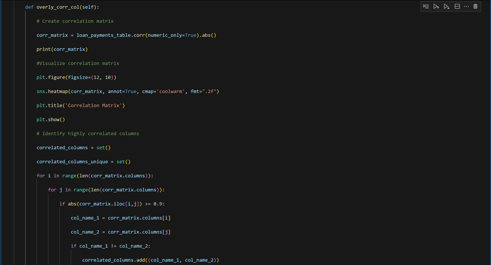
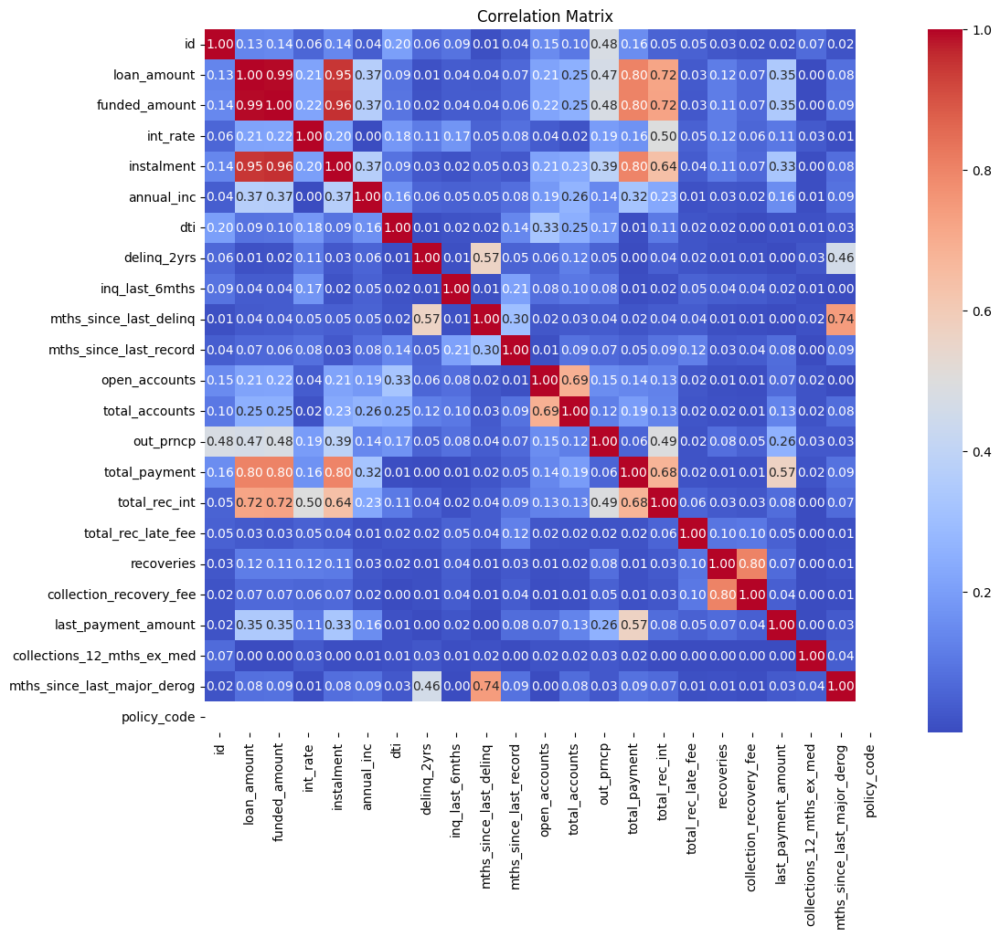
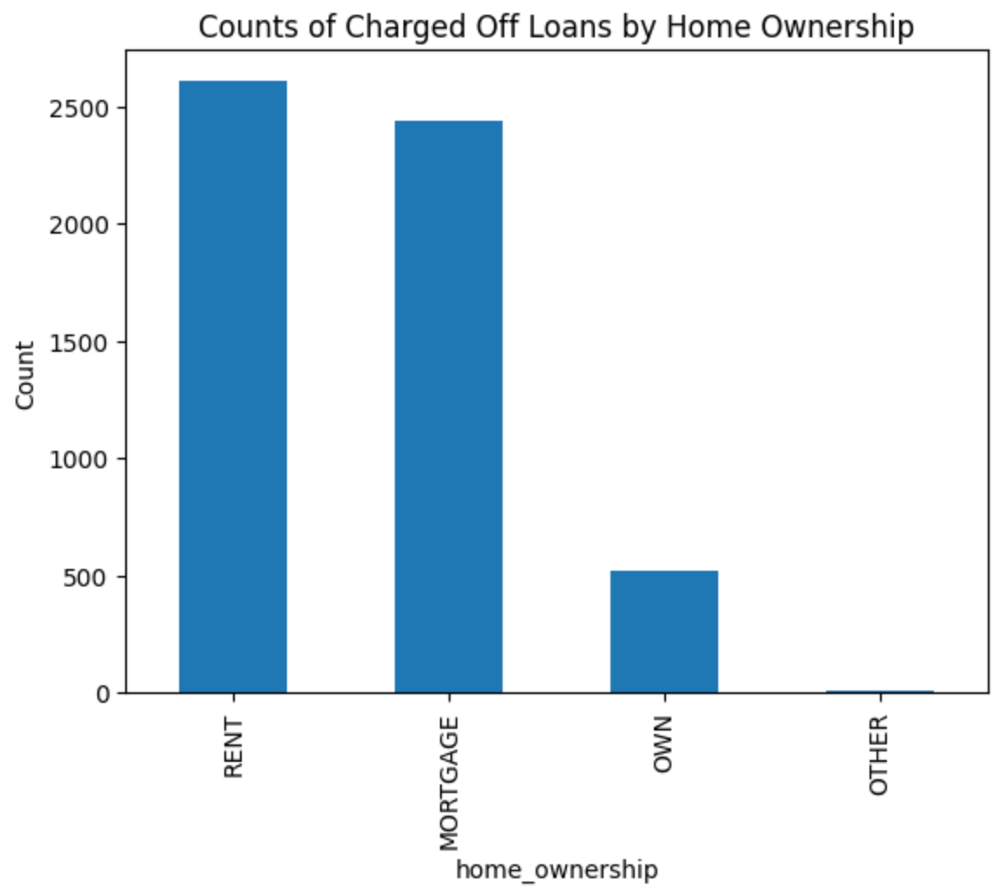

# Exploratory Data Analysis: Customer Loans in Finance

## A description of the project: what it does, the aim of the project, and what I learned

An AiCore industry grade project for a large financial institution relating to managing loans.

The aim of the project is to ensure informed decisions are made about loan approvals and risk is efficiently managed, my task is to gain a comprehensive understanding of the loan portfolio data.

In this project I perform exploratory data analysis on the loan portfolio, using various statistical and data visualisation techniques to uncover patterns, relationships, and anomalies in the loan data.

This information will enable the business to make more informed decisions about loan approvals, pricing, and risk management.

By conducting exploratory data analysis on the loan data, I aim to gain a deeper understanding of the risk and return associated with the business' loans.

Ultimately, my goal is to improve the performance and profitability of the loan portfolio.

### Usage instructions

Run an instance of the class using the RDS Database connector class, then go ahead and try out the different classes on that instance. You'll be able to extract the data and save it into a csv file. Then you'll be able to run a number of data cleaning techniques in pandas.

### Key insights

Here is a screenshot of the class that demonstrates checking for overly correlated columns, i.e columns that are so similar that they're not unique in the information that they provide.

Here is the heatmap output that it has created. From this we can clearly see which columns are so similar that we may aswell drop one of them. I chose a threshold of 0.9, to say that was similar enough it warranted dropping the column.

I also used my own judgement to decide which columns to drop.

From the following graph we can determine how home ownership is related to customer loans being charged off
As we can see Customers who rent or have a mortgage are most likely to have their loans charged off.

### File structure of the project

db_utils.py is a python file that contains an RDS database connector class, that will extract data from the database and save it in a csv file
df.csv is a csv that contains the saved loan payments data frame
credentials.yaml is a locally saved file that is not pushed to github because there are confidential credentials to access the RDS database

In the analysis class we are able to look at the data and answer key business intelligence questions and visualise the data
We answer questions such as:
Does the grade of the loan have effect on customers not paying?
Is the purpose for the loan likely to have an effect?
Does the home_ownership value contribute to the likelihood a customer won't pay?
From this we can inform decisions for investors and management to determine the associated risk of giving loans to customers based on
a variety of factors

### License information